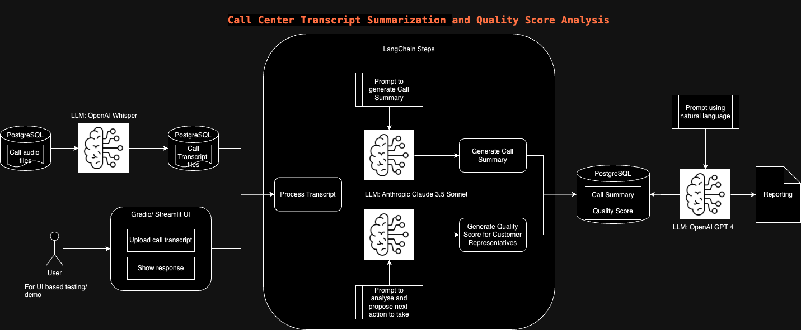

# Design Using LLM and LangChain Agent Integration

## 1. Overview

The system is designed to analyze call transcripts by:

1. **Summarizing**: Generating a summary, key takeaways, and follow-up actions from the call transcript.
2. **Assessing**: Evaluating the quality of the call based on predefined criteria.

### System Design

_Figure 1: Overview of the LangChain Agent integration process._

The core components of the system are:

- **LangChain**: For creating prompts and processing responses from language models.
- **Anthropic API**: For interacting with the language model.

## 2. Components

### Components Used

- **ChatPromptTemplate**: Defines the prompt template for the language model, including formatting instructions.
- **PydanticOutputParser**: Parses the output from the language model into structured data.
- **ChatAnthropic**: Interacts with the Anthropics API to get responses from the language model.

### Steps Involved

1. **Processing Transcript**: Convert raw JSON input into a readable transcript format.
2. **Generating Summary and Assessment**:
    - **Prompt Creation**: Format the prompt using `ChatPromptTemplate`.
    - **Model Interaction**: Use `ChatAnthropic` to send the prompt and receive the summary.
    - **Parsing Response**: Extract relevant data using `PydanticOutputParser`.

## How to Test

1. **Upload a JSON File**: Use the file uploader to select and upload a JSON file containing the call transcript. The JSON should include fields like `call_ID`, `CSR_ID`, `call_transcript`, `call_date`, and `call_time`.
2. **Paste JSON Text**: Alternatively, you can paste the JSON text directly into the text area. Ensure the JSON format is correct.
3. **Submit**: Click the "Submit" button to process the transcript. The application will display:
    - **Call Summary**: A summary of the call.
    - **Key Takeaways**: Important points from the call.
    - **Follow-Up Actions**: Actions categorized into following types:
        - Initiate refund
        - Process improvement
        - Follow up with customer
        - Others
    - **Call Assessment and Quality Score**: Evaluation of the call based on predefined criteria.

