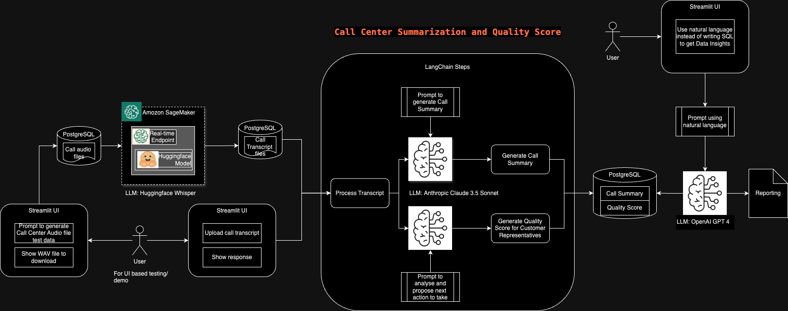

# Call Center Summarization and Quality Score System - Powered by AI/ML

This project automates the process of summarizing call center interactions and generating a quality score for customer representatives. It leverages advanced language models (LLMs) and integrates with various tools to provide efficient call processing and reporting capabilities.

## Watch Demo

<video width="600" controls>
  <source src="images/CallCentersummaryDemoVideo.mov" type="video/quicktime">
  Your browser does not support the video tag.
</video>


## Overview

The system is designed to analyze call transcripts by:

1. **Transcript**: Converting customer call audio files into call transcript using pre-trained <span style="color:#2ECC71"><b>Huggingface hf-asr-whisper-large-v2 model</b></span> deployed in AWS SageMaker.
2. **Summarizing**: Generating a summary, key takeaways, and follow-up actions from the call transcript using <span style="color:#2ECC71"><b>Anthropic Claude 3.5 Sonnet model</b></span>.
3. **Quality Score**: Evaluating the quality of the call and assigning Quality Score to Customer Sales Representaives based on predefined criteria using <span style="color:#2ECC71"><b>Anthropic Claude 3.5 Sonnet model</b></span>.
4. **Data Insights**: Generates reports based on the call summaries and quality scores stored in PostgreSQL using <span style="color:#2ECC71"><b>OpenAI GPT-4</b></span>.

## System Design



## System Components

### 1. Input: Audio Files of Customer and Sales Representatives conversations
- **Storage**: 
  - Call audio files are stored in a **PostgreSQL** database.
- **User Interface**:
  - Users can upload call audio files via a **Streamlit UI**.
  - A prompt allows users to generate test audio data, which can be downloaded as a **WAV file** for testing purposes.

### 2. Transcription and Processing
- **Huggingface Whisper Model**:
  - Call audio files are sent to **Amazon SageMaker**, which hosts the pre-trained **Huggingface hf-asr-whisper-large-v2** model.
  - Real-time transcription is performed to convert the audio into JSON (call transcripts), which are then stored in **PostgreSQL**.

### 3. Call Summary and Quality Score Generation
- **LangChain Integration**:
  - Transcribed call data is processed using **Anthropic Claude 3.5 Sonnet** to:
    1. **Generate Call Summaries**: Create a concise summary of the interaction.
    2. **Generate Quality Scores**: Assign a quality score to customer representatives based on the call.
  - Additional functionality includes analyzing conversations and proposing next-best actions.

### 4. Data Storage
- **PostgreSQL** hosted in **CockroachDB Cloud Cluster** stores:
  - Call transcripts
  - Generated call summaries
  - Quality scores for each call

### 5. Reporting and Insights
- **Natural Language Query**:
  - Users can generate insights using natural language instead of SQL by interacting with a **Streamlit UI**.
- **OpenAI GPT-4**:
  - Utilized to generate reports from the stored data (call summaries and quality scores) in **PostgreSQL**.

## Key Technologies and Models
- **Huggingface Whisper**: Used for audio-to-text transcription.
- **Anthropic Claude 3.5 Sonnet**: Generates call summaries and assigns quality scores.
- **OpenAI GPT-4**: Produces reports and handles natural language queries.
- **LangChain**: Orchestrates interactions between the LLMs for different tasks.
- **gTTS**: For Text To Speech

## User Workflow
1. Upload or generate call audio files using the **Streamlit UI**.
2. The system transcribes audio, generates summaries, and computes quality scores.
3. Data (summaries, scores, etc.) is stored in **PostgreSQL**.
4. Users can query and generate reports using natural language via the **Streamlit UI**.

## How to Run

To run the **Call Center Summarization and Quality Score System**, you need to configure the following environment variables:

### Required Environment Variables
- **`ANTHROPIC_API_KEY`**: Your API key for the **Anthropic Claude 3.5 Sonnet** model.
- **`roach_url2`**: The PostgreSQL database connection URL.
- **`OPEN_API_KEY`**: Your API key for **OpenAI GPT-4**.
- **`LANGCHAIN_API_KEY`**: Your API key for **LangChain** integration.
- **`AWS_ACCESS_KEY_ID`**: AWS access key for authenticating with **Amazon SageMaker**.
- **`AWS_SECRET_ACCESS_KEY`**: AWS secret access key for authenticating with **Amazon SageMaker**.

### Steps to Run

#### 1. Clone the Repository
Clone the project repository and navigate into the project directory:

```bash
git clone <repository_url>
cd <project_directory>
````

#### 2. Set the Environment Variables
Before running the application, ensure that all required environment variables are set. You can set them in your terminal using:

```bash
export ANTHROPIC_API_KEY=<your_anthropic_api_key>
export roach_url2=<your_postgresql_url>
export OPEN_API_KEY=<your_openai_api_key>
export LANGCHAIN_API_KEY=<your_langchain_api_key>
export AWS_ACCESS_KEY_ID=<your_aws_access_key_id>
export AWS_SECRET_ACCESS_KEY=<your_aws_secret_access_key>
````

#### 3. Install Dependencies
Install all the necessary Python dependencies listed in the requirements.txt file:

```bash
pip install -r requirements.txt
````

#### 4. Run the Application
Start the application using Streamlit:

```bash
streamlit run Home.py
````

#### 5. Access the Application
Once the application is up and running, open your web browser and navigate to:

```bash
http://localhost:8501
````

Here, you can interact with the system, upload audio files, and view generated summaries and quality scores.

